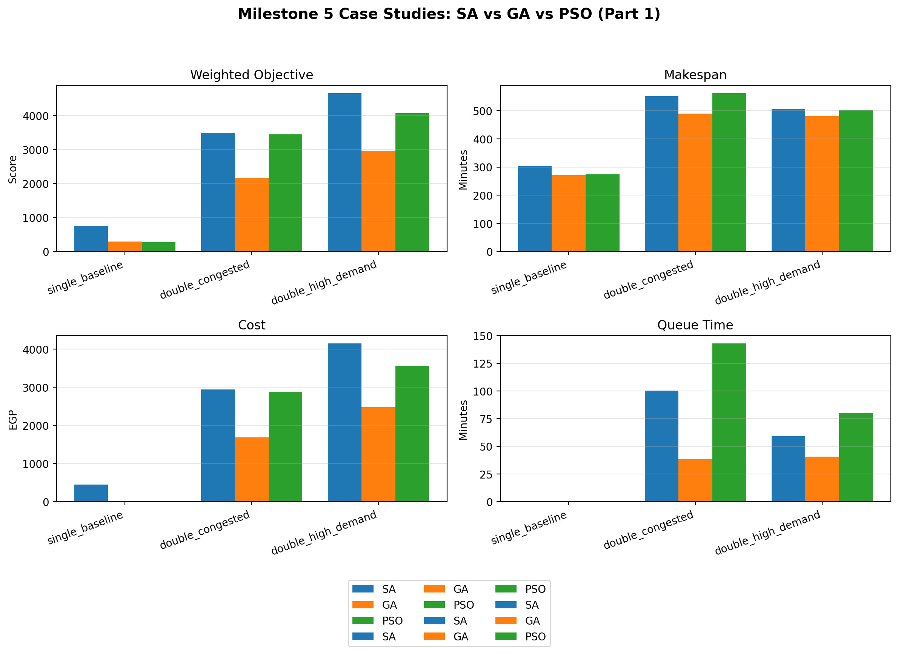
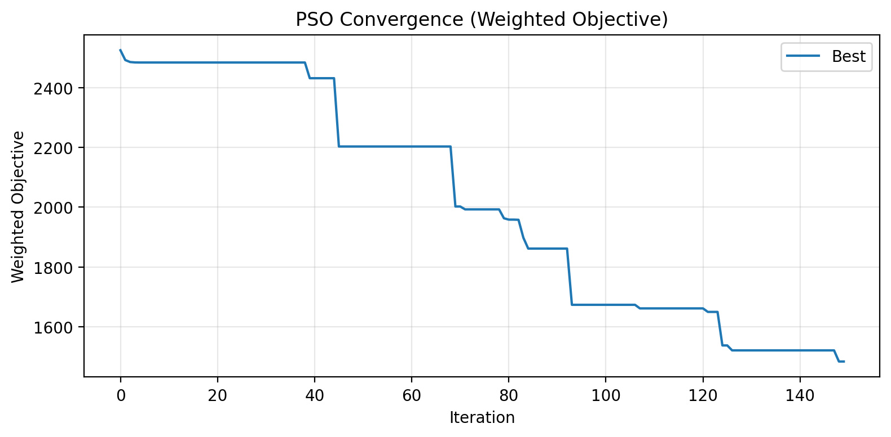

# EV Fleet Routing Optimization

[](LICENSE)
[](https://www.python.org/)
[](https://github.com/youssefrfarid/EV-Fleet-Routing-Optimization/actions)

A multi-algorithm optimization framework for **cooperative electric vehicle fleet routing and charging** on realistic road networks. Compares five approaches — Simulated Annealing (SA), Genetic Algorithm (GA), Particle Swarm Optimization (PSO), Teaching-Learning Based Optimization (TLBO), and Deep Q-Network (DQN) — under nonlinear charging physics, shared station capacity with FIFO queuing, and discrete speed-level trade-offs.

> **Paper** — *Comparative Metaheuristic and Reinforcement Learning Optimization for Cooperative Electric Vehicle Fleet Routing with Nonlinear Charging and Shared Station Capacity* ([PDF](docs/EV_Fleet_Routing_Optimization.pdf))

---

## Table of Contents

- [Overview](#overview)
- [Results](#results)
- [Repository Structure](#repository-structure)
- [Getting Started](#getting-started)
- [Problem Instance](#problem-instance)
- [Authors](#authors)
- [License](#license)

---

## Overview

The system routes multiple heterogeneous EVs through fork-shaped road networks with shared charging stations, jointly minimizing a weighted objective:

$$f \;=\; w_t \cdot \underbrace{\max_{i} \, t^{\text{arr}}_{i,B}}_{f_1:\;\text{makespan}} \;+\; w_c \cdot \underbrace{\sum_{i}\sum_{s} p_s\, E_{i,s}}_{f_2:\;\text{charging cost}}$$

subject to SOC bounds (10–100 %), energy balance along each route, station capacity with FIFO queuing, nonlinear SOC-dependent charging ($\eta = 0.95$), and route connectivity.

### Key Features

- **Nonlinear charging physics** — SOC-dependent power curves with 95 % grid-to-battery efficiency
- **Queue modeling** — FIFO discipline at shared stations with limited plug counts
- **5 discrete speed levels** per road edge (see table below)
- **Heterogeneous fleet** — 3–7 EVs with 40–80 kWh batteries
- **Interactive GUI** — Streamlit app with real-time animated simulation
- **HTML dashboards** — per-solution interactive reports with timelines, SOC traces, and queue stats

### Speed-Level Trade-offs

| Level | Description | Time Factor | Energy Factor |
|-------|-------------|-------------|---------------|
| 1 | Very Slow | +40 % | −25 % |
| 2 | Slow | +20 % | −10 % |
| 3 | Normal | Baseline | Baseline |
| 4 | Fast | −15 % | +20 % |
| 5 | Very Fast | −30 % | +50 % |

### Algorithm Highlights

| Algorithm | Key Mechanism | Parameters | Best Scenario |
|-----------|--------------|------------|---------------|
| **SA** | Trajectory search with geometric cooling ($\alpha = 0.995$) | $T_0 = 1000$, 2 000 iters | Simple networks |
| **GA** | Tournament selection, two-point crossover, elitism (top 10–15 %) | pop = 50, 100 gens, $p_m = 0.1$ | Congested / peak demand |
| **PSO** | Adaptive inertia ($w$: 0.9 → 0.4) with stagnation-triggered exploration spikes | swarm = 50, 100 iters | Uncongested networks |
| **TLBO** | Teacher + Learner phases, hybrid blending for mixed variables | pop = 60, 150 iters, **zero** hyperparams | Limited tuning resources |
| **DQN** | Dueling DQN + Prioritized Replay + Double DQN, 25-dim state | 500 episodes, $\gamma = 0.99$ | Time-critical applications |

---

## Results

### Case Studies

Seven scenarios of increasing complexity were evaluated on single-fork and double-fork topologies:

| Scenario | EVs | Stations | Notes |
|----------|-----|----------|-------|
| Single-Small | 3 | S1/S2/S3 | Standard pricing |
| Single-Large | 7 | S1/S2/S3 | Standard pricing |
| Double-Sparse | 4 | 6 stations | Standard pricing |
| Double-Balanced | 5 | 6 stations | Standard pricing |
| Double-Premium | 4 | 6 stations | Standard pricing |
| Double-Congested | 6 | −1 plug/stn | Standard pricing |
| Double-High Demand | 7 | S2/S5 upgraded | +15 % pricing |

### Metaheuristic Performance (Selected Scenarios)

| Scenario | Algorithm | Objective ($f$) | Makespan (min) | Cost (EGP) |
|----------|-----------|-----------------|----------------|------------|
| Single-Small | SA | 757.2 | 304.2 | 453.1 |
| | GA | 291.6 | 271.6 | 20.0 |
| | **PSO** | **274.3** | 274.3 | 0.0 |
| | TLBO | 363.6 | 285.4 | 78.2 |
| Dbl-Balanced | SA | 2925.2 | 495.8 | 2429.4 |
| | GA | 2089.1 | 493.3 | 1595.8 |
| | **PSO** | **1856.2** | 516.0 | 1340.2 |
| | TLBO | 2742.4 | 492.9 | 2249.4 |
| Dbl-Premium | SA | 2803.8 | 502.8 | 2301.0 |
| | GA | 1919.9 | 469.9 | 1450.0 |
| | **PSO** | **1254.5** | 513.3 | 741.2 |
| | TLBO | 2453.3 | 472.8 | 1980.6 |

### Five-Algorithm Comparison (Double-Fork)

| Scenario | Algorithm | Objective ($f$) | Makespan (min) | Cost (EGP) |
|----------|-----------|-----------------|----------------|------------|
| Baseline (3 EVs) | SA | 2885.0 | 497.1 | 2388.0 |
| | GA | 1805.8 | 475.5 | 1330.2 |
| | **PSO** | **1483.6** | 520.7 | 962.9 |
| | TLBO | 2386.7 | 486.1 | 1900.6 |
| | RL | 4697.9 | **473.1** | 4224.7 |
| Congested (6 EVs) | SA | 3495.1 | 551.5 | 2943.6 |
| | **GA** | **2321.9** | 487.2 | 1834.7 |
| | PSO | 3447.9 | 562.5 | 2885.4 |
| | TLBO | 3150.9 | 500.8 | 2650.1 |
| | RL | 5868.1 | **468.2** | 5399.9 |
| High Demand (7 EVs) | SA | 4657.3 | 505.5 | 4151.8 |
| | GA | 2851.3 | 486.7 | 2364.6 |
| | PSO | 4073.0 | 502.9 | 3570.0 |
| | **TLBO** | **3644.5** | 495.7 | 3148.7 |
| | RL | 7563.9 | **482.1** | 7081.8 |

### Key Findings

- **PSO dominates uncongested scenarios** — 18–40 % lower weighted objective than the next-best algorithm, driven by minimal charging costs.
- **GA is superior under congestion** — maintains consistent performance as fleet size increases (3 → 7 EVs), outperforming PSO which drops from best to third-best.
- **TLBO is competitive with zero tuning** — outperforms SA by 10–25 % despite having no algorithm-specific hyperparameters.
- **RL achieves fastest makespans** (1–5 % faster) but incurs 183–199 % higher charging costs due to reward function weighting.
- **Adaptive inertia for PSO** improves convergence by **16 %** over static schedules (1 483.6 vs 1 760.8 after 150 iterations).
- Extended RL training (1 000 episodes) paradoxically worsens performance, suggesting overfitting.

### Figures

<p align="center">
  
</p>
<p align="center"><em>Figure 1 — Five-algorithm comparison across double-fork scenarios. GA maintains lowest cost under congestion; RL has the highest cost but lowest queue times.</em></p>

<p align="center">
  
</p>
<p align="center"><em>Figure 2 — Benchmark comparison of PSO, GA, and SA on the double-fork baseline. PSO achieves the lowest weighted objective and cost.</em></p>

<p align="center">
  
</p>
<p align="center"><em>Figure 3 — SA vs GA vs PSO across single baseline, congested grid, and high-demand scenarios showing weighted objective, makespan, cost, and queue time.</em></p>

<p align="center">
  
</p>
<p align="center"><em>Figure 4 — Adaptive inertia achieves 16 % lower final objective than a static schedule on the double-fork scenario.</em></p>

<p align="center">
  
</p>
<p align="center"><em>Figure 5 — PSO convergence on the double-fork scenario; objective improves steadily before flattening near iteration 150.</em></p>

<p align="center">
  
</p>
<p align="center"><em>Figure 6 — PSO hyperparameter grid search heatmap ($w \in \{0.4, 0.6, 0.8\}$, $c_1 = c_2 \in \{1.5, 1.7\}$, swarm $\in \{30, 45, 60\}$). Best: $w = 0.6$, $c_1 = c_2 = 1.5$, swarm 45.</em></p>

---

## Repository Structure

```
├── algorithms/
│   ├── ga/genetic_algorithm.py              # Genetic Algorithm
│   ├── pso/particle_swarm.py                # PSO with adaptive inertia
│   ├── pso/compare_weights.py               # Static vs adaptive inertia study
│   ├── pso/pso_experiments.py               # PSO across case studies
│   ├── pso/pso_parameter_sweep.py           # Hyperparameter grid search
│   ├── sa/simulated_annealing.py            # Simulated Annealing
│   ├── tlbo/teaching_learning_optimization.py # TLBO (parameter-free)
│   ├── rl/                                  # DQN agent + environment
│   └── examples/example_algorithm.py        # Template for new algorithms
│
├── common/
│   ├── params.py                  # Network topology, fleet, station config
│   ├── objectives.py              # Objective functions + queue processing
│   ├── feasibility_repair.py      # Constraint repair utilities
│   ├── case_studies.py            # Benchmark scenario builders
│   └── visualization.py           # HTML dashboard generator
│
├── scripts/
│   ├── compare_all_algorithms.py  # Full 5-algorithm comparison
│   ├── run_case_studies.py        # Batch runner with JSON/Markdown export
│   ├── run_metaheuristic_studies_parallel.py  # Parallel metaheuristic runs
│   ├── run_parameter_sensitivity.py # Parameter sensitivity analysis
│   ├── visualize_comparison.py    # Rich HTML comparison reports
│   └── test_*.py                  # Validation scripts
│
├── docs/                          # Algorithm documentation and guides
├── outputs/                       # Results (JSON, CSV, plots, dashboards)
├── app.py                         # Streamlit GUI application
├── requirements.txt
├── .gitignore
└── LICENSE
```

---

## Getting Started

### Installation

```bash
git clone https://github.com/youssefrfarid/EV-Fleet-Routing-Optimization.git
cd EV-Fleet-Routing-Optimization
pip install -r requirements.txt
```

### Run Individual Algorithms

```bash
python algorithms/sa/simulated_annealing.py     # SA demo + dashboard
python algorithms/ga/genetic_algorithm.py        # GA demo + dashboard
python algorithms/pso/particle_swarm.py          # PSO demo + dashboard
python algorithms/tlbo/teaching_learning_optimization.py  # TLBO demo
```

### Run Benchmarks

```bash
python scripts/compare_all_algorithms.py         # Full 5-algorithm comparison
python scripts/run_case_studies.py               # All scenarios → JSON + tables
python scripts/run_parameter_sensitivity.py      # Sensitivity analysis
```

### Launch the GUI

```bash
streamlit run app.py
```

### Quick API Usage

```python
from common.params import make_toy_params
from common.objectives import objective_weighted

params = make_toy_params()  # 5 EVs, 3 stations, fork network

# Run any optimizer
from algorithms.ga.genetic_algorithm import run_ga_double_fork_demo
solution = run_ga_double_fork_demo()

# Evaluate
score = objective_weighted(solution, w_time=1.0, w_cost=1.0)
```

---

## Problem Instance

### Fleet (5 Vehicles)

| Vehicle | Battery | Initial SOC | Type |
|---------|---------|-------------|------|
| EV 1 | 40 kWh | 62% | Compact (Nissan Leaf) |
| EV 2 | 55 kWh | 48% | Sedan (Chevy Bolt) |
| EV 3 | 62 kWh | 45% | Sedan+ (Leaf Plus) |
| EV 4 | 75 kWh | 52% | SUV (Model Y) |
| EV 5 | 80 kWh | 47% | Large SUV (e-tron) |

### Charging Stations

| Station | Type | Speed | Price (EGP/kWh) | Plugs |
|---------|------|-------|-----------------|-------|
| S1 | Budget | 50 kW | 13.0 | 2 |
| S2 | Premium | 180 kW | 27.0 | 1 |
| S3 | Standard | 100 kW | 20.0 | 1 |

### Network Topology

```
A → J → { Upper: S1 → S2 → M  (longer, more stations)
         { Lower: S3 → M        (shorter, hillier)
M → B
```

---

## Authors

| Name | Affiliation |
|------|-------------|
| **Andrew Abdelmalak** | Mechatronics Engineering, GUC |
| **Daniel Ekdawi** | Mechatronics Engineering, GUC |
| **Daniel Boules** | Mechatronics Engineering, GUC |
| **David Girgis** | Mechatronics Engineering, GUC |
| **Youssef Ramy** | Media Engineering Technology, GUC |

## Report

The full project report is available in [`docs/EV_Fleet_Routing_Optimization.pdf`](docs/EV_Fleet_Routing_Optimization.pdf).

## Acknowledgments

This project was developed as part of the Mechatronics Engineering program at the German University in Cairo (GUC).

---

## References

1. S. Pelletier, O. Jabali, and G. Laporte, "Goods distribution with electric vehicles: Review and research perspectives," *Transportation Science*, 50(1), 2016.
2. M. Schneider, A. Stenger, and D. Goeke, "The electric vehicle-routing problem with time windows and recharging stations," *Transportation Science*, 48(4), 2014.
3. A. Froger *et al.*, "The electric vehicle routing problem with capacitated charging stations," *Transportation Science*, 56(2), 2022.
4. S. R. Kancharla and G. Ramadurai, "Electric vehicle routing problem with non-linear charging and load-dependent discharging," *Expert Systems with Applications*, 160, 2020.
5. M. Keskin *et al.*, "A simulation-based heuristic for the electric vehicle routing problem with stochastic waiting times," *Comput. & Oper. Res.*, 125, 2021.
6. S. Karakatic, "Optimizing nonlinear charging times of electric vehicle routing with genetic algorithm," *Expert Systems with Applications*, 164, 2021.

## License

Apache 2.0 — see [LICENSE](LICENSE).
