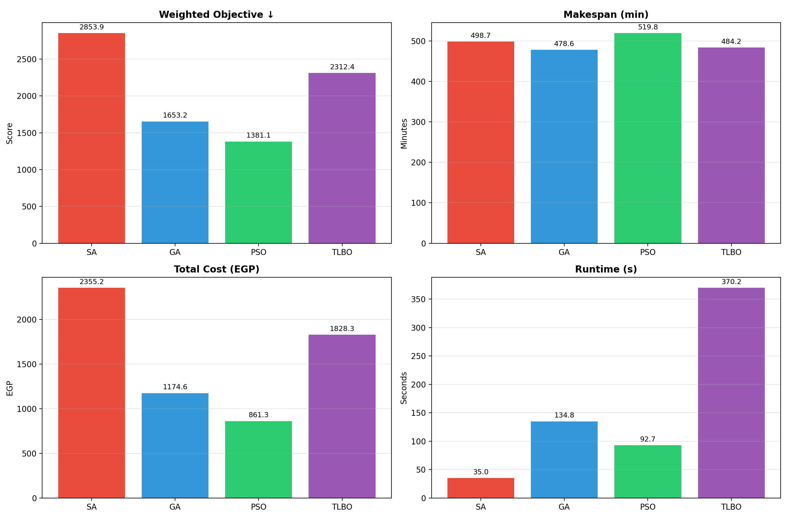
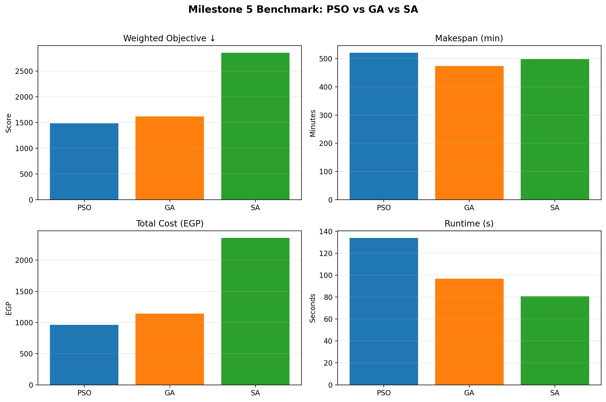
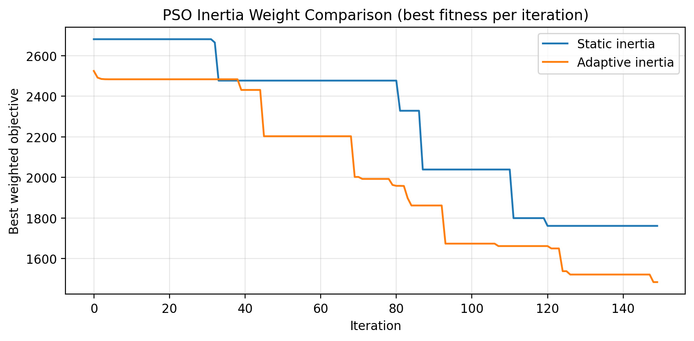
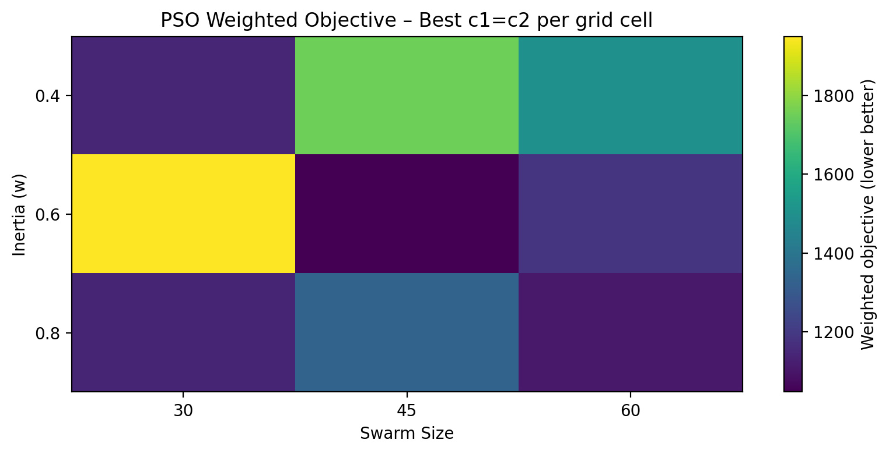

# EV Fleet Routing Optimization

[](LICENSE)
[](https://www.python.org/)

A multi-algorithm optimization framework for **cooperative electric vehicle fleet routing and charging** on realistic road networks. Compares five approaches — Simulated Annealing (SA), Genetic Algorithm (GA), Particle Swarm Optimization (PSO), Teaching-Learning Based Optimization (TLBO), and Deep Q-Network (DQN) — under nonlinear charging physics, shared station capacity with FIFO queuing, and discrete speed-level trade-offs.

---

## Overview

The system routes multiple heterogeneous EVs through a fork-shaped road network with charging stations, jointly minimizing:

1. **Makespan** — time for the last vehicle to complete its journey  
2. **Total charging cost** — sum of all charging expenses

### Key Features

- **Realistic charging physics** — SOC-dependent power curves with 95% grid-to-battery efficiency
- **Queue modeling** — FIFO discipline at shared stations with limited plug counts
- **5 discrete speed levels** per road edge (energy vs. time trade-off)
- **Heterogeneous fleet** — 3–7 EVs with 40–80 kWh batteries
- **Interactive GUI** — Streamlit app with real-time animated simulation
- **HTML dashboards** — per-solution interactive reports with timelines, SOC traces, and queue stats

### Algorithm Highlights

| Algorithm | Strengths | Best Scenario |
|-----------|-----------|---------------|
| **PSO** | Lowest weighted objective (18–40% better) | Uncongested networks |
| **GA** | Robust under congestion | High-demand / peak periods |
| **TLBO** | Zero hyperparameters, consistent | Limited tuning resources |
| **SA** | Baseline comparison | Simple networks |
| **DQN** | Fastest makespan (1–5% faster) | Time-critical applications |

---

## Results

<p align="center">
  
</p>
<p align="center"><em>Figure 1 — Five-algorithm comparison across case studies.</em></p>

<p align="center">
  
</p>
<p align="center"><em>Figure 2 — PSO vs GA vs SA benchmark on the double-fork network.</em></p>

<p align="center">
  
</p>
<p align="center"><em>Figure 3 — Adaptive vs static inertia weight convergence for PSO.</em></p>

<p align="center">
  
</p>
<p align="center"><em>Figure 4 — PSO hyperparameter grid search results.</em></p>

---

## Repository Structure

```
├── algorithms/
│   ├── ga/genetic_algorithm.py              # Genetic Algorithm
│   ├── pso/particle_swarm.py                # PSO with adaptive inertia
│   ├── pso/compare_weights.py               # Static vs adaptive inertia study
│   ├── pso/pso_experiments.py               # PSO across case studies
│   ├── pso/pso_parameter_sweep.py           # Hyperparameter grid search
│   ├── sa/simulated_annealing.py            # Simulated Annealing
│   ├── tlbo/teaching_learning_optimization.py # TLBO (parameter-free)
│   ├── rl/                                  # DQN agent + environment
│   └── examples/example_algorithm.py        # Template for new algorithms
│
├── common/
│   ├── params.py                  # Network topology, fleet, station config
│   ├── objectives.py              # Objective functions + queue processing
│   ├── feasibility_repair.py      # Constraint repair utilities
│   ├── case_studies.py            # Benchmark scenario builders
│   └── visualization.py           # HTML dashboard generator
│
├── scripts/
│   ├── compare_all_algorithms.py  # Full 5-algorithm comparison
│   ├── run_case_studies.py        # Batch runner with JSON/Markdown export
│   ├── run_metaheuristic_studies_parallel.py  # Parallel metaheuristic runs
│   ├── run_parameter_sensitivity.py # Parameter sensitivity analysis
│   ├── visualize_comparison.py    # Rich HTML comparison reports
│   └── test_*.py                  # Validation scripts
│
├── docs/                          # Algorithm documentation and guides
├── outputs/                       # Results (JSON, CSV, plots, dashboards)
├── app.py                         # Streamlit GUI application
├── requirements.txt
├── .gitignore
└── LICENSE
```

---

## Getting Started

### Installation

```bash
git clone https://github.com/youssefrfarid/EV-Fleet-Routing-Optimization.git
cd EV-Fleet-Routing-Optimization
pip install -r requirements.txt
```

### Run Individual Algorithms

```bash
python algorithms/sa/simulated_annealing.py     # SA demo + dashboard
python algorithms/ga/genetic_algorithm.py        # GA demo + dashboard
python algorithms/pso/particle_swarm.py          # PSO demo + dashboard
python algorithms/tlbo/teaching_learning_optimization.py  # TLBO demo
```

### Run Benchmarks

```bash
python scripts/compare_all_algorithms.py         # Full 5-algorithm comparison
python scripts/run_case_studies.py               # All scenarios → JSON + tables
python scripts/run_parameter_sensitivity.py      # Sensitivity analysis
```

### Launch the GUI

```bash
streamlit run app.py
```

### Quick API Usage

```python
from common.params import make_toy_params
from common.objectives import objective_weighted

params = make_toy_params()  # 5 EVs, 3 stations, fork network

# Run any optimizer
from algorithms.ga.genetic_algorithm import run_ga_double_fork_demo
solution = run_ga_double_fork_demo()

# Evaluate
score = objective_weighted(solution, w_time=1.0, w_cost=1.0)
```

---

## Problem Instance

### Fleet (5 Vehicles)

| Vehicle | Battery | Initial SOC | Type |
|---------|---------|-------------|------|
| EV 1 | 40 kWh | 62% | Compact (Nissan Leaf) |
| EV 2 | 55 kWh | 48% | Sedan (Chevy Bolt) |
| EV 3 | 62 kWh | 45% | Sedan+ (Leaf Plus) |
| EV 4 | 75 kWh | 52% | SUV (Model Y) |
| EV 5 | 80 kWh | 47% | Large SUV (e-tron) |

### Charging Stations

| Station | Type | Speed | Price (EGP/kWh) | Plugs |
|---------|------|-------|-----------------|-------|
| S1 | Budget | 50 kW | 13.0 | 2 |
| S2 | Premium | 180 kW | 27.0 | 1 |
| S3 | Standard | 100 kW | 20.0 | 1 |

### Network Topology

```
A → J → { Upper: S1 → S2 → M  (longer, more stations)
         { Lower: S3 → M        (shorter, hillier)
M → B
```

---

## Authors

| Name | Affiliation |
|------|-------------|
| **Andrew Abdelmalak** | Mechatronics Engineering, GUC |
| **Daniel Ekdawi** | Mechatronics Engineering, GUC |
| **Daniel Boules** | Mechatronics Engineering, GUC |
| **David Girgis** | Mechatronics Engineering, GUC |
| **Youssef Ramy** | Media Engineering Technology, GUC |

## Report

The full project report is available in [`docs/EV_Fleet_Routing_Optimization.pdf`](docs/EV_Fleet_Routing_Optimization.pdf).

## License

Apache 2.0 — see [LICENSE](LICENSE).
